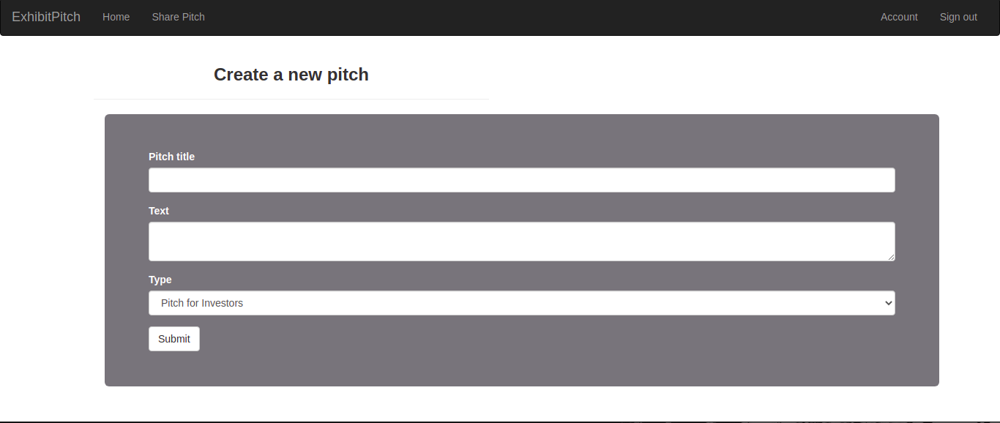

# Exhibit Pitch
A Python Web App that allows users to post pitches and allow other users to upvote downvote and also leave comments.

## Description.
This is a Ptython built web app that allows a user to create a pitch and have it posted only after signing up and logging in. The web app provides a list of pitches posted by users and filters them by category, also the users can upvote or downvote on a pitch and also leave a review.

## Author & Contact Information.
This web app was created by Kevin Kipyegon. If you have any suggestions or improvements you can reach the author via mail at kevin.kipyegon@student.moringaschool.com

## Technologies Used
1. Python
2. Flask
3. Heroku - Deployment
4. HTML
5. CSS/Bootstrap

## Installation
<li>Clone the Repository
<ul> - git clone: https://github.com/kevaf/ExhibitPitch.git  
- cd NewsCatchUp  
- Open with desired code editor(Recommended VS Code)  
- Install requirements  
- Run: chmod a+x start.sh  
- Run: ./start.py

## ScreenShot.

## Liscence.
This is an open source project avaiable under the [MIT Liscence](LISCENCE).